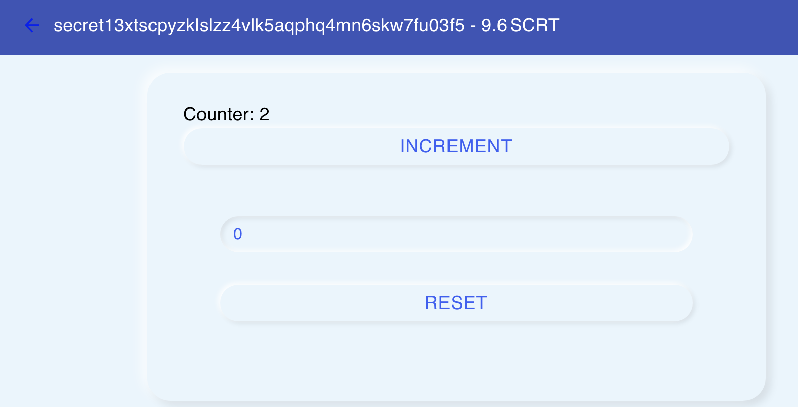

# Secret Counter

This quickstart guide will help you start learning how to develop secret contracts and secret apps! It includes a simple example of a secret contract, named secret counter, along with a React interface. Follow the steps below and let us know any feedback 🙂

### Clone this repository
```bash
git clone https://github.com/enigmampc/secret-counter.git
cd secret-counter && yarn
```

### Start the network
```bash
# Also starts nginx to proxy requests to the api server
docker-compose up
```

### Start the rest-server so we can query the network
```bash
# in a new terminal
docker-compose exec secretdev \
  secretcli rest-server \
  --node tcp://localhost:26657 \
  --trust-node \
  --laddr tcp://0.0.0.0:1317
```

### Start the faucet, to fund burner wallets
```bash
# in a new terminal
git clone https://github.com/enigmampc/SecretNetwork/
# use develop branch for now
cd SecretNetwork/cosmwasm-js
git checkout develop
# build the JS components
yarn && yarn build
# start the faucet
cd packages/faucet
yarn dev-start
```

### Fund the faucet holder (if this is different from your test account)
```bash
docker-compose exec secretdev \
  secretcli tx send \
  a secret1pkptre7fdkl6gfrzlesjjvhxhlc3r4gmenn2dx \
  100000000000uscrt --from a \
  --keyring-backend test --yes
```

### Deploy the contract
```bash
cd client
node scripts/deploy_counter.js
```

### Start the app
```bash
cd client
yarn start:local
```

### Give it a try!

